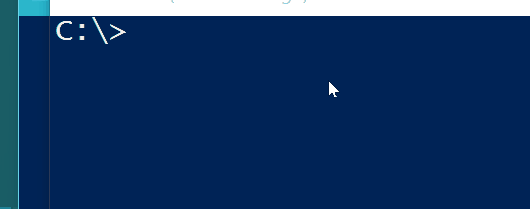

# posh-HumpCompletion
When working with some PowerShell modules, there can be a large number of cmdlets, and the cmdlet names can get quite long.
posh-HumpCompletion adds support for "hump completion". This means that it will use the capitals in the cmdlet name as the identifiers, 
i.e. `"Get-DC<tab>"` would complete for Get-DnsClient, Get-DnsClientCache, Get-DscConfiguration, Get-DomainController etc.


[](https://ci.appveyor.com/project/stuartleeks/posh-humpcompletion)


## Installation

### PowerShell Gallery

You can install [posh-HumpCompletion](https://www.powershellgallery.com/packages/posh-HumpCompletion/) via the [PowerShell Gallery](https://www.powershellgallery.com/)

```powershell
Install-Module -Name posh-HumpCompletion

```

<!--
### Chocolatey
Make sure you have [chocolatey](https://chocolatey.org) installed.

Currently the installation is only on a myget feed, so install using:
```powershell
choco install posh-HumpCompletion -source "https://www.myget.org/F/posh-humpcompletion/api/v2" -pre
```
-->

## Instructions
Hopefully this is fairly simple to use!

If you have a command that you want to complete for then you can type the capitals in the name and then Tab to complete.

E.g. for Get-AzureRmResourceGroup you can use `Get-ARRG<tab>`
Repeated tabs will cycle matches (in this case, Get-AzureRmResourceGroupDeployment etc)



### Tips
For performance, posh-HumpCompletion caches the loaded commands. 
If you load new modules or otherwise change the set of commands (Azure PowerShell & Switch-AzureMode, I'm looking at you!) then run `Clear-HumpCompletionCommandCache` to reset. 
[Bonus tip: use `"Clear-HCCC<tab>"` :-)]

## Release notes

### Version 0.4.0 - 26th May 2017
Pushed to PowerShell Gallery 26th May 2017


Improve perf of command cache loading which reduces the time to be able to add completion. Changed the processing to create the cache over to C# code via Add-Type.

### Version 0.3.0 - 26th May 2017
Pushed to PowerShell Gallery 26th May 2017


Fix background loading


Change the behaviour of completion so that it no longer blocks if the background load hasn't completed, instead you get no completion. 
Will experiment with this for a bit and see which behaviour makes sense (or whether it should be an option)


### Version 0.2.0 - 23rd May 2016
Pushed to myget feed 23rd May 2016


Convert to working with ASTs instead of raw string parsing.
With this change the tab expansion now works even when you're not at the end of the input string

Added support for expansion of parameter names and variable names

### Version 0.1.4 - 20th January 2016
Pushed to myget feed 20th January 2016

Update to only check command cache when participating in completion
Update to start loading the command cache in the background when the module loads

### Version 0.1.3 - 30th November 2015
Pushed to myget feed 30th November 2015

Fix parameter completion bug

### Version 0.1.1 - 30th November 2015
Pushed to myget feed 30th November 2015

Remove debug output left in code!

### Version 0.1.0 - 30th November 2015
Pushed to myget feed 30th November 2015

Added support for partial matching, i.e. `Get-AzRSub<tab>` will match `Get-AzureRmSubscription`

### Version 0.0.11 25th November 2015
Pushed to PowerShell Gallery

Pushed to myget feed

Fixed some typos/script styling - thanks @korygill ;-)

### Version 0.0.8 - 2nd November 2015
Pushed to myget feed 2nd November 2015

Minor tweaks and packaging for chocolatey

### Version 0.0.3 - 28th October 2015
Added caching of command details. If you add load new modules, run Clear-HumpCompletionCommandCache to update the tab completion

### Version 0.0.2 - 28th October 2015
Added partial matching support. So now, Get-DC completes Get-DnsClient, but also Get-DnsClientCache

### Version 0.0.1 - 27th October 2015
The first version, basic functionality implemented
